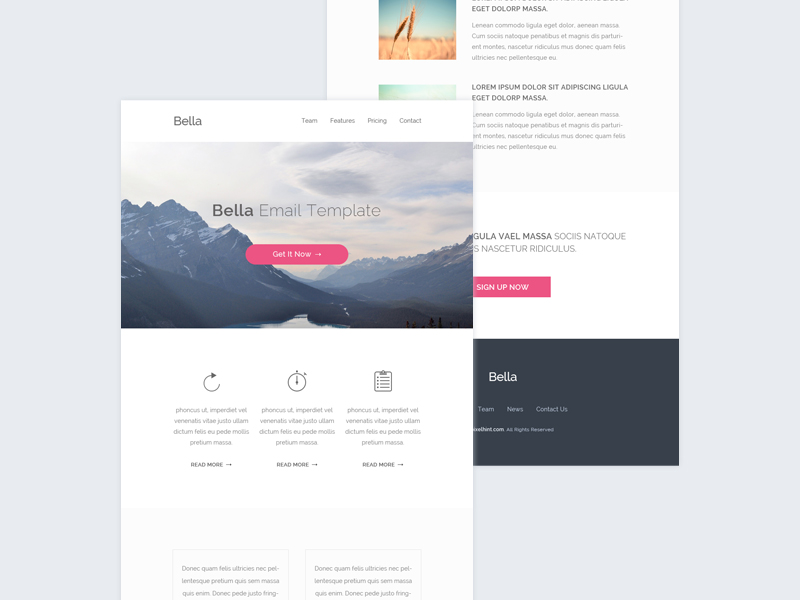

# Introduction to HTML & CSS Workshop-Day 2
--

## The Grid Layout
- Most modern layouts operate on a standard 12-column grid system.
- If you break down any of the websites you know and love you will notice many variations on the 12 column grid.
- Each column in the grid can contain nested grids itself.
- If you want a larger box, you need to have a greater column offset.
- Here is a good pictorial to help you break it down:


## Code-Along: Let's Create Our Own Grid
- We will create a 2 and 3 column grid.

# Responsive Design

## Twitter Bootstrap
- Bootstrap is a front-end framework that incorporates a grid system, UI components, JavaScript widgets and more.
- Let's take a look at the documentation: [http://getbootstrap.com](http://getbootstrap.com/).
- The framework consists of one main CSS file, an optional theme CSS file, and a main JS file.
- Bootstrap requires jQuery to work, which is a JavaScript framework.

## Using Bootstrap
- To use Bootstrap you have to include the three required files.
- Bootstrap files can be linked via the CDN provided, or downloaded locally onto the computer.
- Remember to place your reference to the jQuery library above your reference to the Bootstrap JS code.

## Bootstrap Columns
- Columns are written in this format as a class attribute: col-(breakpoint)-(offset).
- An example of a three-column layout may be to use the class col-sm-4.
- All columns should be wrapped into an element with a class of row.
- So the complete three-column layout may look something like this:

```
<div class="row">
	<div class="col-sm-4">
		Content Here
	</div>
	<div class="col-sm-4">
		Content Here
	</div>
	<div class="col-sm-4">
		Content Here
	</div>
</div>
```

## Breakpoints
- The way that Bootstrap works is to dynamically reduce column size according to the window size.
- To be mobile-friendly, the columns will break into a stack layout after a minimum width is detected.
- The breakpoints you can select in your columns control at which point this happens.
- Check out their documentation [here](http://getbootstrap.com/css/#grid) to see what these breakpoints are in terms of size.

## CSS3 Media Queries
- Media queries allow you to apply and remove CSS styling based on the screen dimensions.
- This is important to create truly mobile-friendly layouts.
- To use it you have to specify screen resolution thresholds.
- Let's try an example where we want to show a div where the screen size is larger than 700 pixels:

HTML

```
<div id="my-div"></div>
```

CSS

```
@media(min-width: 700px) {
	#my-div {
		width:400px;
		height:400px;
		border:#000 1px solid;
	}
}
```

- Now where the screen size is below 700 pixels:

CSS

```
@media(max-width: 700px) {
	#my-div {
		width:400px;
		height:400px;
		border:#000 1px solid;
	}
}
```

- You can also combine these values to select a range:

```
@media(min-width: 700px) and (max-width: 900px) {
	#my-div {
		width:400px;
		height:400px;
		border:#000 1px solid;
	}
}
```

- Good news! Bootstrap does this for you!

## UI Elements
- Bootstrap wraps in a myriad of great UI elements that you can drop in anywhere on your site.
- With Bootstrap you can make really pretty things quickly.
- Let's look at some [examples](http://getbootstrap.com/components/).

## Putting it Together
- Let's take a look at some of the bootstrap examples located [here](http://getbootstrap.com/getting-started/#examples).
- We will code together the "Jumbotron Narrow" template located [here](http://getbootstrap.com/examples/jumbotron-narrow/).
- Before we start, let's also plan out our grid system.

## In-Class Lab
- For this lab we will be coding from scratch [this Bootstrap template](http://getbootstrap.com/examples/offcanvas/).
- Try not to look at the code through the code inspector. 
- First plan out the grid you will use, then figure out which components you will need.
	- Hint: There is a jumbotron in there.

## CSS Transitions
- Transitions allow you to go between element states smoothly.
- You will often use these for animations with CSS.
- This is the syntax:

```
transition: property duration easing;
```

Let's take a look at an example:

```
.box {
	width:100px;
	height:100px;
	background-color:blue;
	transition: width 1s ease-in-out;
}

.box:hover {
	width:200px;
	height:200px;
	background-color:red;
	transition: width 1s ease-in-out;
}
```

- You can specify `all` instead of each property to animate the entire state.

## Email Templates 
- Using tables can allow for nesting (tables within tables)
- Gives you control over where you position things



## In-Class Lab / Homework
- The goal is to practice creating a one-page site where you apply what you learned this weekend. You can feel free to take one of the two bootstrap themes you created today or take your about.me portfolio from yesterday and clone one of them. You can also start from scratch which I recommend. Here are the main concepts we learned this weekend: **classes,ids, margin, padding, inline vs. block elements, floats and clear, column layouts and various UI elements using Twitter Bootstrap, CSS transitions.**